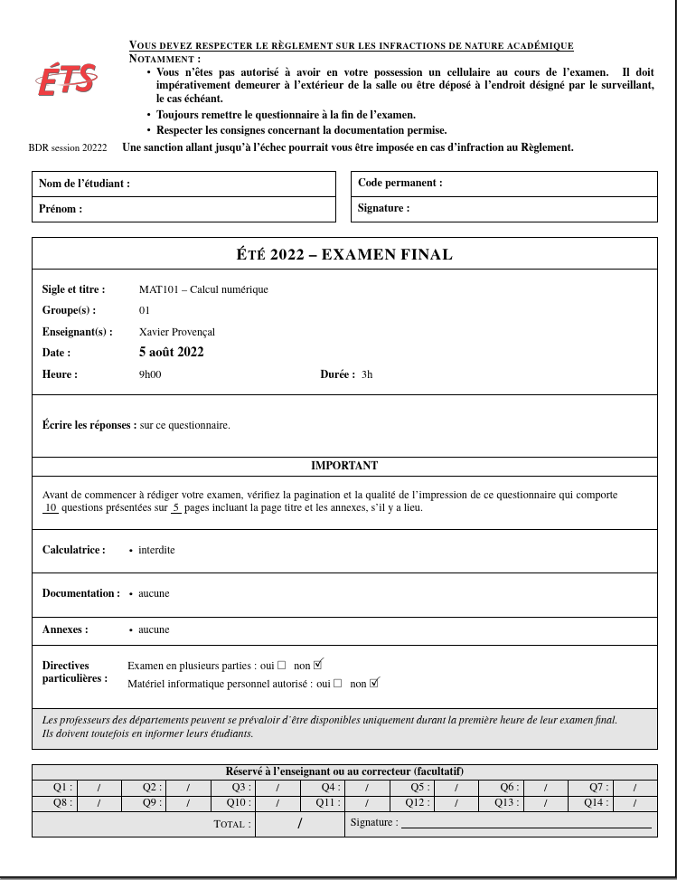
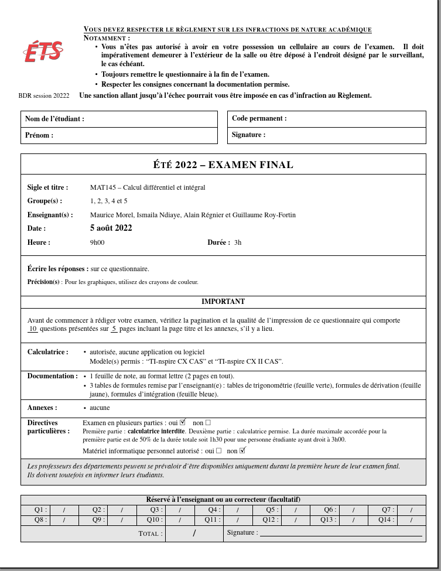

# Page titre pour les examen intra et finaux à l'ÉTS


La [page titre officielle](https://www.etsmtl.ca/docs/personnel-enseignant-examens-finaux/documents/page-titre) au format Word ainsi que son [guide de rédaction](https://www.etsmtl.ca/docs/personnel-enseignant-examens-finaux/documents/Explications-de-la-page-titre) sont disponibles à l'adresse suivante :

[https://www.etsmtl.ca/personnel-enseignant-examens-finaux](https://www.etsmtl.ca/personnel-enseignant-examens-finaux)

Le but de ce projet est d'offrir une alternative en LaTeX.

<a href="./images/exemple_simple.png"></a>
<a href="./images/exemple_complexe.png"></a>


## Utilisation

1. Ajouter les fichiers suivants à votre projet :
 - `pagetite-ets.sty`
 - `logo_ets.png`
 - `configPageTitre.tex`

2. Inclure la page-titre et le fichier de configuration. En entête de votre
   document ajouter les lignes:
```latex
\usepackage{pagetitre-ets}
\input{configPageTitre.tex}
```

3. Configurer la page titre en modifiant le fichier `configPageTitre.tex`.

4. Immédiatement après la commande `\begin{document}`, ajouter la ligne
```latex
\pagetitreETS
```


## TODO

Bug : la taille du texte de la page titre est affecté par le paramètre de taille de
la commande `\documentclass`.


